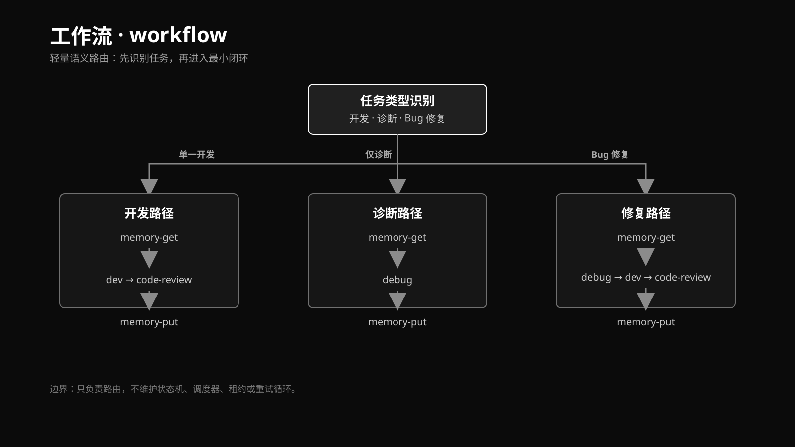
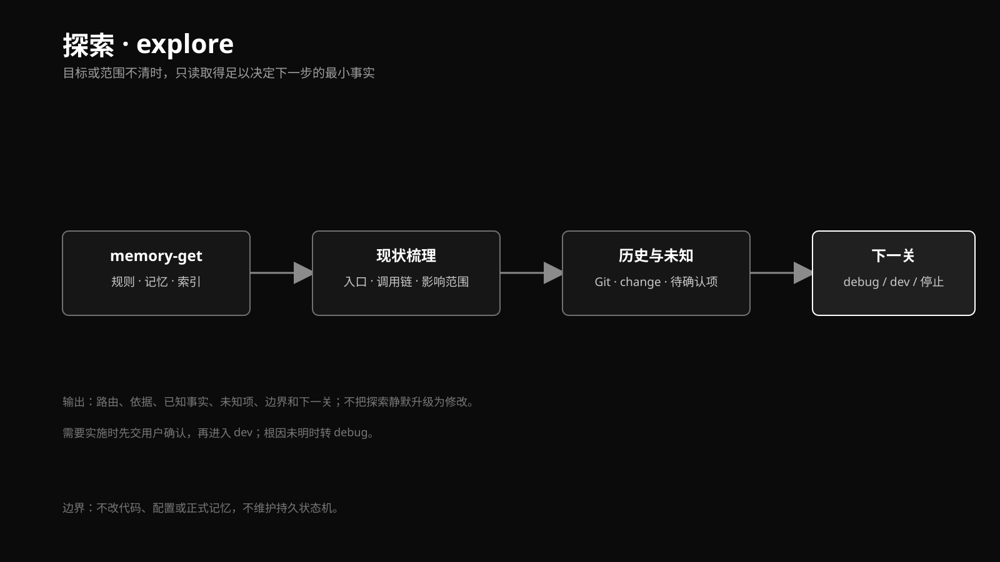
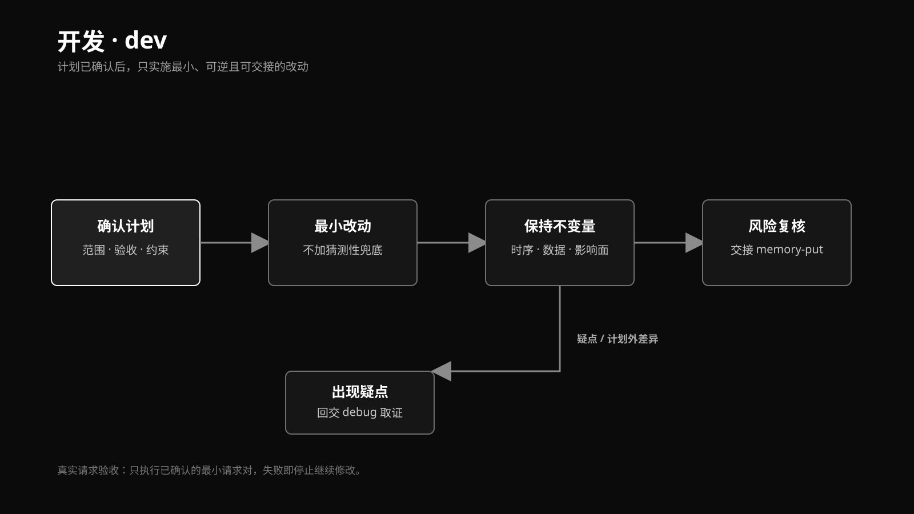
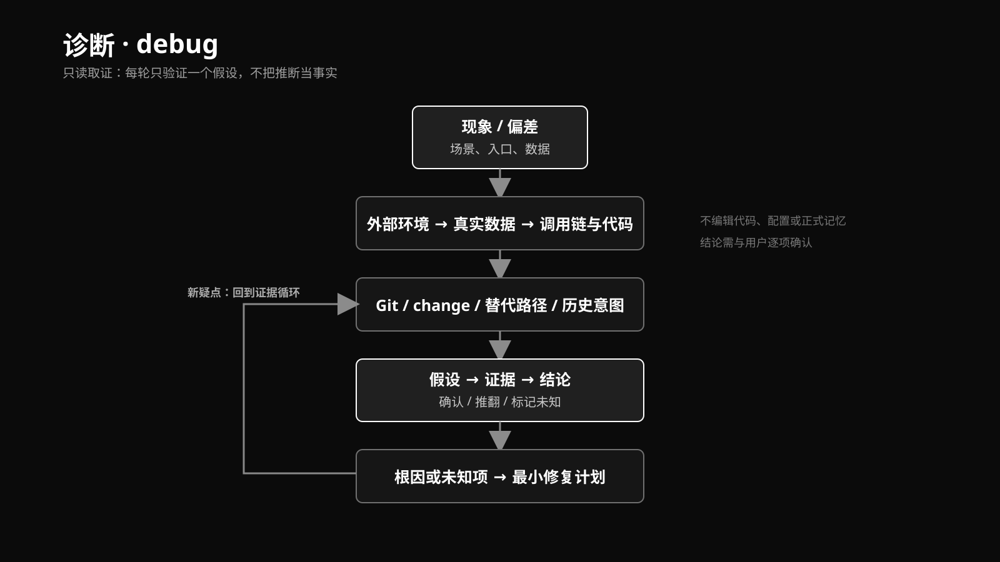
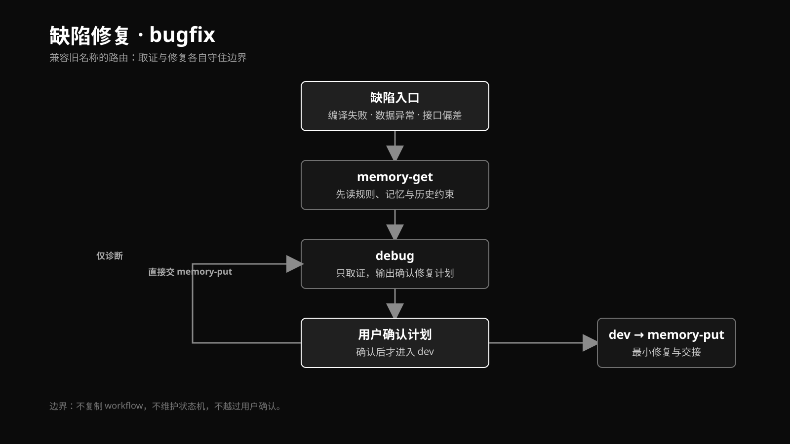
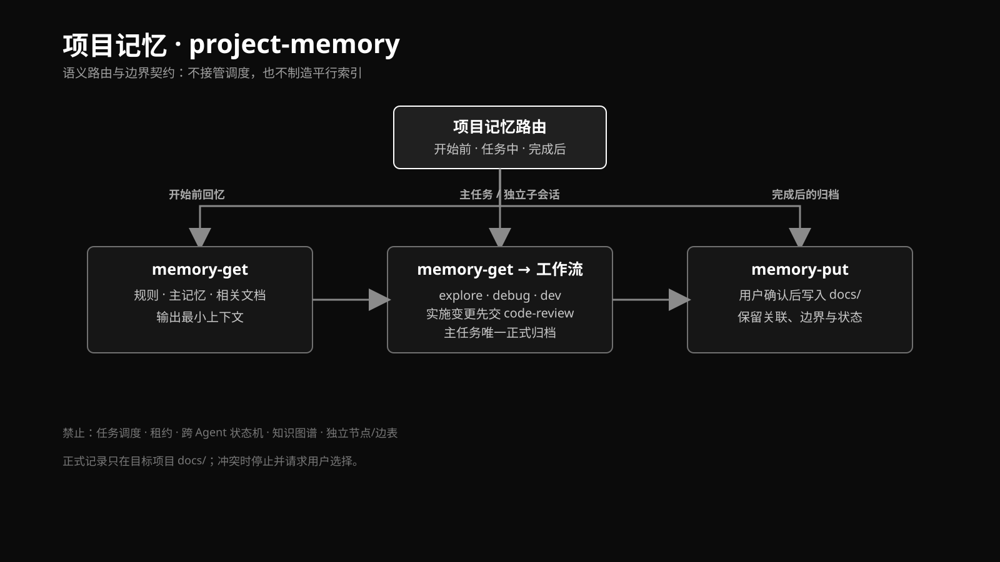
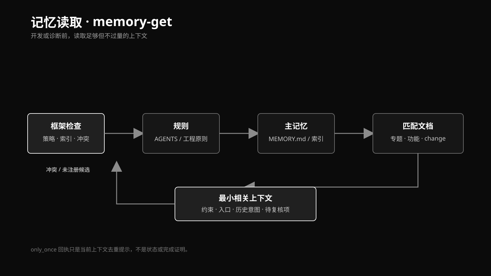
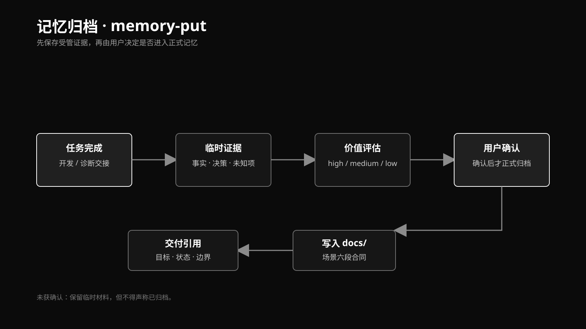
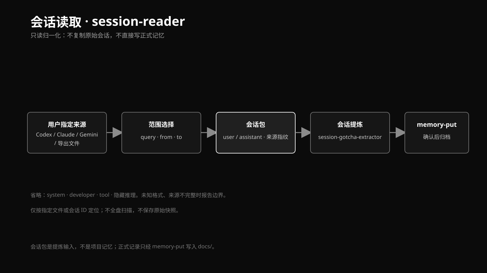
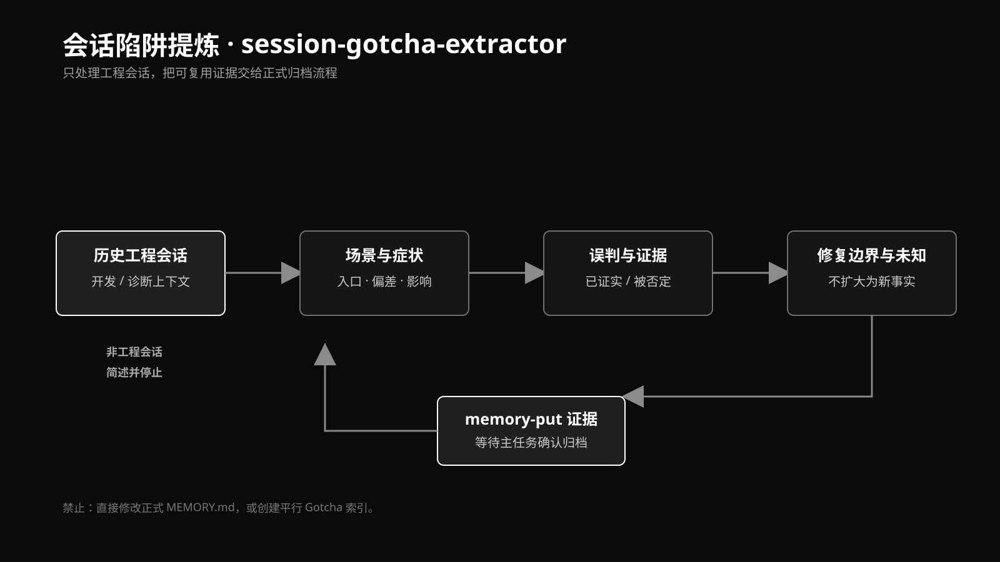

# 叫唤-开发-工作流

这是一个跨宿主插件(Plugin)，内部包含多个可独立触发的技能(Skill)，用于沉淀“架构师 + 开发”的工程原则、开发/排障工作流和项目记忆约束。`~/.agents/skills` 是共享 Skill 源；`.codex-plugin/`、`.claude-plugin/` 与 `.zcode-plugin/` 是宿主插件清单，插件只负责合集身份、版本和自动发现，不把多个 Skill 合并成一个文件。`ZCode` 分支额外提供 `hooks/`（SessionStart 合集感知）和 `session-reader` 的 ZCode 会话源适配。

## Skill 专题图

`docs/assets/` 当前包含以下 10 张 SVG。文件名与 Skill 名称一一对应，表中说明用于快速定位；具体执行规则以对应 `SKILL.md` 和工程原则为准。

| 图示文件 | 对应 Skill | 作用说明 |
| --- | --- | --- |
| [`skill-workflow.svg`](docs/assets/skill-workflow.svg) | `workflow` | 按任务语义选择最小闭环；有实施变更时在归档前增加 `code-review` 收尾节点，不维护持久状态机(State Machine)或调度器。 |
| [`skill-explore.svg`](docs/assets/skill-explore.svg) | `explore` | 目标、范围或历史意图不清时只读梳理现状和未知项，决定转入 `debug`、`dev` 或停止。 |
| [`skill-dev.svg`](docs/assets/skill-dev.svg) | `dev` | 计划确认后实施最小、可逆改动，保持时序、数据和影响面不变量；出现计划外疑点时回交 `debug`。 |
| [`skill-debug.svg`](docs/assets/skill-debug.svg) | `debug` | 只读取证，按外部环境、真实数据、调用链与历史意图逐层验证单一假设，输出根因或未知项及修复计划。 |
| [`skill-bugfix.svg`](docs/assets/skill-bugfix.svg) | `bugfix` | 兼容旧名称的缺陷入口，连接 `memory-get`、`debug`、用户确认、`dev`、`code-review` 和 `memory-put`；仅诊断时可直接交接归档。 |
| [`skill-project-memory.svg`](docs/assets/skill-project-memory.svg) | `project-memory` | 约束项目记忆的读取、任务交接和确认后归档边界，不接管任务调度，也不建立平行索引。 |
| [`skill-memory-get.svg`](docs/assets/skill-memory-get.svg) | `memory-get` | 开发或诊断前读取规则、主记忆和已登记匹配文档的最小相关上下文；用户明确请求时可查看记忆树。 |
| [`skill-memory-put.svg`](docs/assets/skill-memory-put.svg) | `memory-put` | 汇总任务临时证据，经价值评估和用户确认后写入 `docs/` 正式记忆；未确认时只保留临时材料。 |
| [`skill-session-reader.svg`](docs/assets/skill-session-reader.svg) | `session-reader` | 只读用户指定的会话或导出文件，输出带来源指纹、范围和省略边界的会话包，不复制原始会话。 |
| [`skill-session-gotcha-extractor.svg`](docs/assets/skill-session-gotcha-extractor.svg) | `session-gotcha-extractor` | 从历史工程会话提炼场景(Scene)、误判、证据、边界和未知项，交给 `memory-put`，不直接修改正式记忆或创建平行陷阱(Gotcha)索引。 |

以下概念图用黑底白字展示各专题的核心入口、流程和边界：





















## 四层结构

1. **共享工程原则**：证据优先、先理解后修改、历史意图追溯、最小且可逆的改动、控制变量、按影响面验证和风险复核。
2. **工作流**：`workflow` 负责语义路由，`explore`、`debug`、`dev` 分别处理澄清、诊断和开发；`bugfix` 保留为兼容路由。
3. **项目记忆与轻量存储**：`project-memory`、`memory-get`、`memory-put`，以及其单一 CLI、策略、索引、任务临时证据、路径摘要与归档实现。
4. **会话证据与外部引用扩展**：`session-reader` 只读指定会话并输出标准化会话包，`session-gotcha-extractor` 提炼场景(Scene)和陷阱(Gotcha)；`code-review` 与 `requesting-code-review` 提供独立收尾审查；全局方法型技能(Skill)仅按需引用，不属于本插件。

`tools/project-memory-settings/`、`skills/project-memory/scripts/runtime/` 和 JSON 策略是第三层的实现，不是另一类技能(Skill)。入口 `SKILL.md` 只保留触发、边界和交接；不可省略的执行规则位于 `rules/engineering-principles.md` 及各 Skill 的 `references/`，随插件一起发布。

`session-reader` 不复制厂商原始会话，也不把会话写入 `.agents/skills/`。它只读取用户明确指定的文件或会话 ID，输出带来源指纹、范围和省略边界的标准化会话包；提炼结果仍交给 `memory-put`，厂商格式变化只影响读取适配器。

## 插件命名空间

本项目的发布单位是插件，Skill 仍按目录独立维护：

- Claude Code：插件名为 `jiaohuanworkflow`，使用 `jiaohuanworkflow:<skill>`，例如 `jiaohuanworkflow:debug`。
- Codex：保留已安装的 `jiaohuan-develop-workflow:<skill>` 兼容名称，例如 `jiaohuan-develop-workflow:debug`。
- ZCode：`ZCode` 分支使用 `.zcode-plugin/plugin.json`，插件名同为 `jiaohuan-develop-workflow`，Skill 前缀为 `jiaohuan-develop-workflow:<skill>`；会话启动时由 `hooks/hooks.json` 注入合集感知提醒（见下文 ZCode Hook）。
- Gemini、Claude、Codex 的裸目录副本仅用于共享发布和兼容发现，唯一 Skill 源仍是 `~/.agents/skills`，不得在端点手工修改。

Claude 插件根目录包含 `.claude-plugin/plugin.json` 和 `skills/`；Codex 插件根目录包含 `.codex-plugin/plugin.json` 和同一份 `skills/`。ZCode 兼容识别 `.zcode-plugin/`、`.claude-plugin/` 与 `.codex-plugin/` 三种清单位置，`ZCode` 分支以原生 `.zcode-plugin/` 为准。因此同一套能力可被不同宿主按各自命名空间发现。

## ZCode Hook

`hooks/session-start.js` 在每次 SessionStart（含 `startup`、`resume`、`clear`、`compact`）通过 `additionalContext` 注入一条只读提醒：动态枚举 `skills/` 下实际存在的 SKILL.md 清单与主链路，落实“新会话必读合集”规则。该 hook 只输出上下文、不写文件、不维护状态，失败时静默退出不阻塞会话；需要 Node.js 运行时。

ZCode 引用的插件源必须是仓库工作区之外的稳定导出副本：`~/.zcode/plugin-workspace/jiaohuan-develop-workflow`（含 `.zcode-plugin/`、`hooks/`、`skills/`、`rules/`、`tools/`、`README.md` 和记录来源分支/提交/时间的 `EXPORT-INFO.md`）。禁止把 Git 工作区直接注册为插件源——切换分支会改变或移除 `ZCode` 分支专属文件。更新流程：检出最新代码后执行 `node tools/export-zcode.js`（跨平台，无 Git Bash 依赖），再在客户端重新加载插件。

客户端接入走“插件市场”入口：根目录 `marketplace.json` 声明本地市场 `jiaohuan-local`，其中唯一插件 `jiaohuan-develop-workflow` 的 `source` 为 `./`。运行 `node tools/export-zcode.js` 后按输出提示操作：Settings → Plugin Management → Discover → “+”选择导出副本目录，市场添加成功后在插件卡片上点击安装；插件身份为 `jiaohuan-develop-workflow@jiaohuan-local`。

## 主链路

```text
开发：memory-get -> dev -> code-review -> memory-put
诊断：memory-get -> debug -> memory-put
修复：memory-get -> debug -> dev -> code-review -> memory-put
探索：memory-get -> explore -> memory-put
```

多个独立目标或并行请求，先由用户选择主智能体(Agent)串行、异步子智能体(Agent)取证或独立子会话/任务，三种模式不得混用。主智能体(Agent)串行的每个独立任务和独立子会话都拥有完整链路；异步子智能体(Agent)只写本任务的临时证据，主任务唯一负责 `memory-put` 和正式归档。运行时不维护持久流程状态机(State Machine)、任务调度、租约或重试；主任务的 `temp/<task>/path.json` 是可落盘的临时跨智能体(Agent)子上下文，按保留策略处理。用户手动触发保留轮转时，可在已验证归档后仅重试待完成的源材料清理。

## 项目记忆

`memory-get` 按受控索引读取最小必要规则和记忆，并在标签未命中时只扫描已登记文档的标题、摘要、检索词和路径摘要；`memory-put` 先记录临时证据，只有用户确认归档或明确要求记录时才评估价值并写入 `docs/`。正式归档必须关联主任务和至少一份受管临时证据，且会拒绝疑似凭据。`project-memory` 不保存跨智能体(Agent)的工作流状态。

主任务可维护 `path.json`，记录简短排查节点、父节点、状态、证据引用和结论；异步智能体(Agent)只能写临时草稿。路径摘要复用场景(Scene)既有六段，不建立第二索引。

用户明确查看文档结构时，使用只读标题树命令：

```bash
node skills/project-memory/scripts/project-memory.js outline --file skills/debug/SKILL.md --depth 3
```

它只返回标题、层级和行号；内部按需读取文件但不返回正文，不创建索引、不改变记忆策略。需要完整枝叶时将 `--depth` 调到 `6`。标题树是导航摘要，不是事实验证。

正式文档只能位于目标项目 `docs/`：

- `docs/MEMORY.md` 与根 `AGENTS.md` 以相对路径双向索引。
- `docs/memory/` 保存可复用的专题、功能和场景(Scene)记忆；`docs/change/` 保存一次变更的范围、决策、验证和历史关联。
- 已注册有效索引优先；两个未注册候选同时存在时优先 `docs/MEMORY.md`。索引冲突停止并请求用户决定。
- 既有记忆只能经 `migrate`、`keep` 或双确认 `reset` 处理；不自动物理删除旧记忆。

场景(Scene)是完整正式记录，陷阱(Gotcha)是固定第六段，内容可空。遗留 `gotcha-index` 仅用于迁移，退出正式主链。

同标题场景摘要变化时，`put` 默认返回替代确认，不会静默追加或覆盖；核对历史并先建立 `docs/change/` 记录后，用 `--replace --change-record docs/change/<记录>.md` 明确覆盖，或以新标题写入并关联 `superseded`。物理删除只在用户单独确认且已有备份时进行。

策略文件为 `<project>/.agents/project-memory/memory-policy.json`，`memory_get_mode` 可为 `only_once`、`auto`、`manually`、`do_not_get`，默认 `auto`。`only_once` 检索回执(receipt)只是当前上下文的去重提示，不是检索完成或事实正确的证明；`manually` 的普通查询使用 `--manual`，记忆树查询视为用户主动请求。

```bash
node skills/project-memory/scripts/project-memory.js path \
  --task <任务> --node A --summary '简短节点摘要' \
  --status 已证实 --evidence evidence.md --conclusion '结论'
```

## 命令行(CLI)与图形界面(GUI)

统一入口为 `skills/project-memory/scripts/project-memory.js`。本地图形界面(GUI)位于 `tools/project-memory-settings/`，仅绑定 `127.0.0.1`，经统一入口读取策略、轮转和清理；它不直接写正式记忆、不注册计划任务、不修改全局智能体(Agent)设置。

接口证据使用 `skills/debug/scripts/http-check.sh`。请求体放入临时文件，敏感请求头只通过 `--secret-header` 环境变量传入；写请求和读请求分别执行并断言关键字段，失败回到 `debug`。令牌默认由用户提供；用户明确授权登录接口和凭据时，仅在任务级临时命令中换取令牌，不建立通用登录测试平台。真实请求必须先得到用户对目标环境的明确授权。

```bash
bash skills/debug/scripts/http-check.sh \
  --url "$BASE_URL/<path>" \
  --method POST \
  --header 'Content-Type: application/json' \
  --secret-header 'Authorization=API_TOKEN' \
  --data-file "$REQUEST_FILE" \
  --expect-status 200 \
  --expect-contains '关键字段'
```

## 发布边界

隔离样例已人工验收 CLI 初始化、双向索引、四种读取策略、标题树、主/子任务草稿、确认归档、GUI 回环接口、七日周归档、七周清理和 HTTP 脱敏请求检查。新增的 `--replace --change-record` 仅完成静态核查，待用户授权的隔离样例人工验收。以上均不是目标项目的真实业务验收。

发布时按单向路径执行：`~/.agents/skills` 共享发布源 -> Git 仓库及宿主插件副本 -> Gemini、Claude 等 Agent 端点；覆盖前先备份，禁止两处手工漂移。同步逻辑不属于项目记忆运行时。Codex 与 Claude 的 `plugin.json` 均只声明宿主认可的插件元数据，不把运行时规则重复写入清单。当前 Claude 本地插件已安装为 `jiaohuanworkflow@jiaohuanworkflow`；后续版本仍需从中央源重新同步并重新安装。

ZCode 差异化边界（仅存在于 `ZCode` 分支）：`.zcode-plugin/plugin.json` 版本为 `0.3.0+zcode.<时间戳>`；session-reader 的 `zcode` 来源解析以 `model_io` 记录结构为准，厂商字段变化只修改读取适配器；ZCode rollout 真实会话已完成本机只读冒烟验收（可见消息重建、system/thinking 省略报告），跨机器与历史版本格式仍需人工确认后再用于正式提炼。
