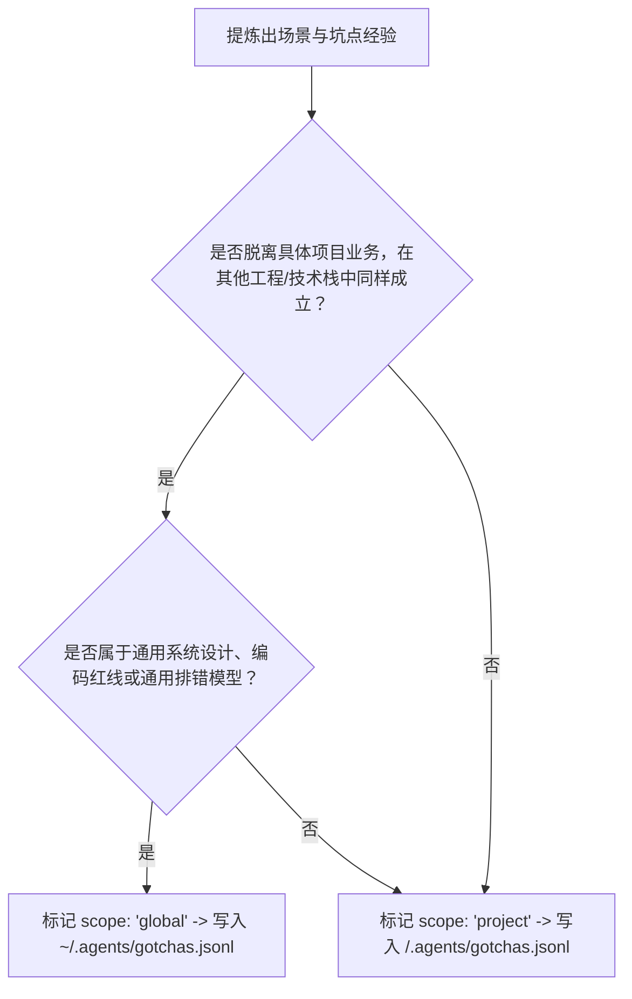

# Gotcha 场景与陷阱条目契约 (gotcha-contract.md)

本文档定义 `session-gotcha-extractor` 的数据字段、双层存储路由、版本演进与路径安全边界。

---

## 一、双层存储路由与数据格式

- **格式要求**: JSON Lines (JSONL)，统一强制 `UTF-8` 编码，严禁注入 BOM 头。每一行为单条自包含、合法的 JSON 对象。
- **双层存储路由策略**:
  1. **全局存储 (`~/.agents/gotchas.jsonl`)**：
     - 适用场景：不依赖具体项目、跨语言跨技术栈高度通用的设计模式与工程铁律。
     - 目的：供所有工程全局复用，驱动 Plugin 自身能力进化。
  2. **项目存储 (`<项目根目录>/.agents/gotchas.jsonl`)**:
     - 适用场景：依赖当前项目业务、环境配置或私有工具链的规则。
     - 根目录解析：支持命令行 `--project-root <path>` 显式指定；未指定时默认从当前工作目录 (`process.cwd()`) 向上递归查找工程根目录标志（`.git`、`AGENTS.md`、`.agents`、`package.json`），未找到时回退到 `process.cwd()`。
     - 安全路径边界：任何自定义 `--target` 必须严格限制在 `project-root` 范围内，禁止通过 `../` 或绝对路径越界逃逸。

### 通用性评估决策树 (Generality Decision Tree)

---

## 二、字段契约定义 (Schema)

| 字段名 | 类型 | 必填 | 描述与约束 |
|---|---|---|---|
| `schema_version` | integer | 是(新条目) | Schema 契约版本号，当前版本为 `1`。历史旧条目缺失时向前兼容容错。 |
| `id` | string | 是 | 唯一主键，格式为 `gotcha-YYYYMMDD-XXXX`（例如 `gotcha-20260920-0001`） |
| `timestamp` | string | 是 | 记录生成的 ISO 8601 时间戳（例如 `2026-09-20T14:00:00+08:00`） |
| `scope` | string | 是 | 存储作用域，枚举值必须为：`global`（全局通用）或 `project`（项目专用） |
| `category` | string | 是 | 场景分类，枚举值必须为：`bugfix`、`dev`、`explore` |
| `title` | string | 是 | 简短描述场景与避坑要点（建议 15~40 字中文） |
| `scene` | string | 是 | 发生的具体工程上下文（语言、环境、模块或前置操作） |
| `symptom` | string | 是 | 异常表象、直观报错信息或误导性现象 |
| `misjudgment` | string | 是 | 初始误判假设、容易走入的思维误区或导致弯路的直觉推测 |
| `root_cause_and_solution` | string | 是 | 经证实的真实根因与经过验证的最小闭环解法 |
| `guidance_and_constraint` | object | 是 | 后续处理建议和限制，包含 `guidance` 与 `constraint` |
| `guidance_and_constraint.guidance` | string | 是 | 正向建议：引导后续同类任务的排查策略、提示词要点或规范指南 |
| `guidance_and_constraint.constraint` | string | 是 | 硬性约束：强制禁止的操作或必须前置执行的红线边界 |
| `value_assessment` | object | 是 | 价值评估对象 |
| `value_assessment.level` | string | 是 | 评估等级：`high`（高度通用/易错高危）、`medium`（特定场景通用） |
| `value_assessment.generality` | string | 否 | 通用性评估：`universal`（普适设计/规范）、`project_specific`（工程特定） |
| `value_assessment.rationale` | string | 是 | 判定该等级与路由的理由 |

---

## 三、价值评估与自迭代反哺机制

1. **高价值门槛**：拒绝无实质复用价值的临时操作流水账。入库条目必须具备明确的“误判分析”与“正反引导约束”。
2. **简洁写入**：字段只写事实、原因、处理和约束；避免套话、空话和重复背景。
3. **版本演进**：通过 `schema_version` 保障数据模式迭代，所有新增条目强制携带版本号。
